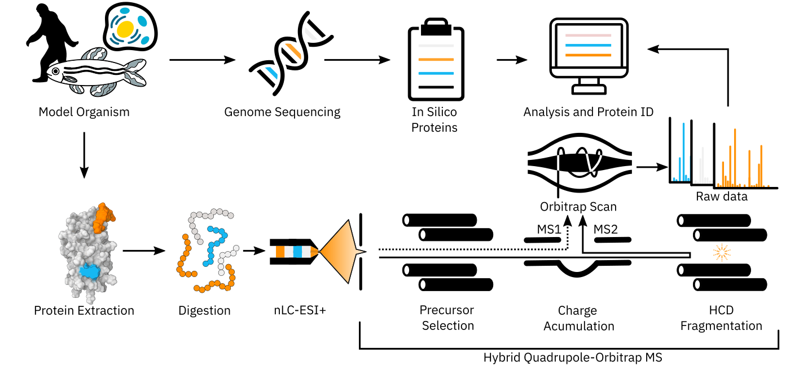
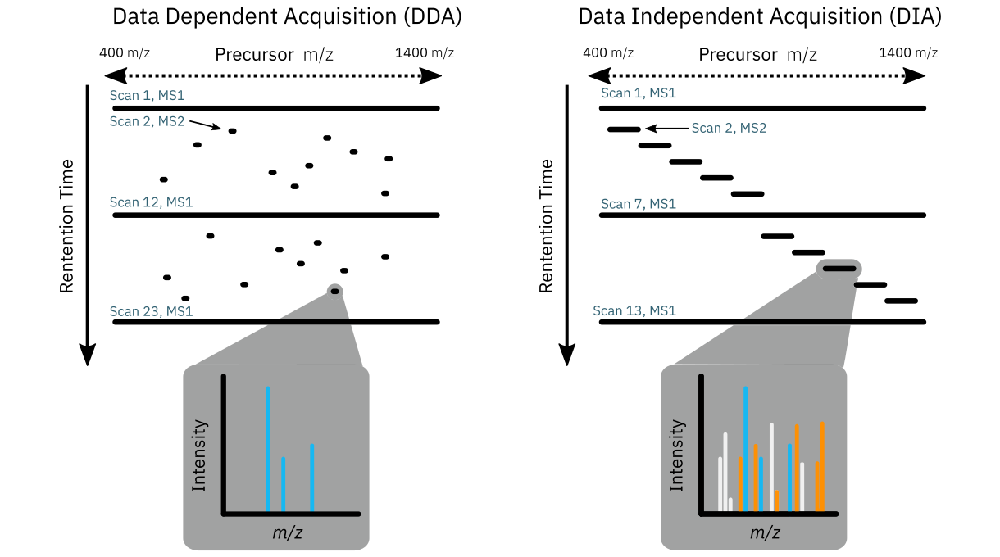

<!-- 

  Good references: 
    - example from U Sydney: https://github.com/garthtarr/sydney_xaringan
    - 
    
-->
    

```{r setup, include=FALSE}
options(htmltools.dir.version = FALSE)
knitr::opts_chunk$set(
  #fig.width=9, fig.height=3.5, fig.retina=3,
  #out.width = "100%",
  cache = FALSE,
  echo = FALSE,
  message = FALSE, 
  warning = FALSE,
  hiline = TRUE
)
```

```{r xaringan-themer, include=FALSE, warning=FALSE}
library(xaringanthemer)

# Colours

white     <- "#FFFFFF"
max_red   <- "#DE1A1A"
old_gold  <- "#E0BE36"
onyx      <- "#444545"
yale_blue <- "#274C77"


style_duo_accent(
  primary_color = onyx,
  secondary_color = yale_blue,
  inverse_header_color = old_gold,
  # fonts
  header_font_google = google_font("Fira Sans", "200"),
  text_font_google = google_font("IBM Plex Sans"),
  code_font_google = google_font("Fira Code")
)
```

# Chemical Proteomics Methods for Elucidating the Physical Protein Targets of Environmental Contaminants
### David Hall

---


## This is the first slide talking about interactions between chemicals...


---


## Intro 1


---


## Intro 2: Commerncial and Env. chemicals might interact with proteins

.center2[
```{r, out.height="120%" }
knitr::include_graphics(path = "images/tsca_lipinksi.png")
```
]


---


## Intro 3: Proteomics is a thing



---


## Intro 4


---


## Intro 5


---


## Intro 6


---

## Intro 7

---
class: inverse center middle

# DBPs


---


## DBP formation, incidence, and mechanisms


---


## Health issues with DBPs


---


## Cellular assays


---


## ABPP protein targets


---


## Direct Adducts 


---


## GAPDH results and illustration


---


## DBP conclusions


---
class: inverse center middle


# FSPE


---


## PFAS backgrounds


---


## PFAS adducts andtheory


---


## FTAC adduct rectivity


---


## FSPE workflow


---


## FSPE 8:2 FTAC results


---


## FSPE sequence,GAPDH, and aggregation


---


## F13-IAM results 


---


## FSPE Conclusions


---
class: inverse center middle


# 74 PFAS ELS Zebrafish


---


## 74 PFAS Project


---


## 74 PFAS Tox results


---


## DIA proteomics scheme



---

## 

---
class: inverse center middle

# Conclusion


