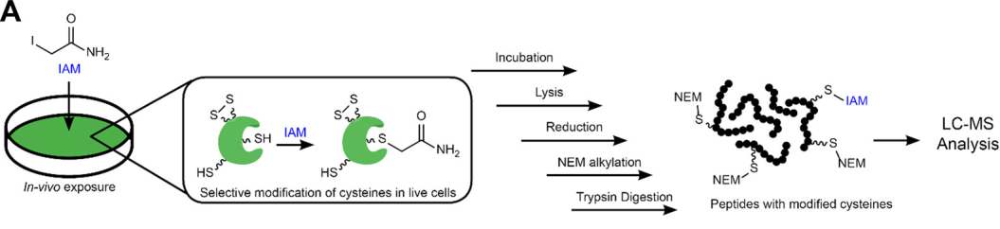

<!-- 

  Good references: 
    - example from U Sydney: https://github.com/garthtarr/sydney_xaringan
    - 
    
-->
    

```{r setup, include=FALSE}
options(htmltools.dir.version = FALSE)
knitr::opts_chunk$set(
  # fig.width=9, fig.height=3.5, fig.retina=3,
  # out.width = "100%",
  cache = FALSE,
  echo = FALSE,
  message = FALSE, 
  warning = FALSE,
  hiline = TRUE
)
```

```{r xaringan-themer, include=FALSE, warning=FALSE}
library(xaringanthemer)

# Colours

white     <- "#FFFFFF"
max_red   <- "#DE1A1A"
old_gold  <- "#E0BE36"
onyx      <- "#444545"
yale_blue <- "#274C77"
powder_blue <- "#BFEDEF"

light_grey <- "#D3D3D3"
steel_blue <- "#3E7CB1"
rich_black <- "#051014"
safety_orange <- "#F17300"
maroon <- "#A13D63"
hookers_green <- "#567568"


style_duo(
  #colours  
  primary_color = "#D3D3D3",
  secondary_color = "#F17300",
  inverse_header_color = "#051014",
  header_color = "#051014",
  inverse_text_color = "light_grey",
  # fonts
  header_font_google = google_font("IBM Plex Sans Extralight"),
  text_font_google = google_font("IBM Plex Sans"),
  code_font_google = google_font("Fira Code"),
  # Positions
  #padding = ("0px 40px 10px 20px"),
  # font sizes
  header_h1_font_size = "2rem",
  header_h2_font_size = "2rem",
  header_h3_font_size = "1.25rem",
  
)
```

```{r xaringan-tile-view, echo=FALSE}
library(xaringanExtra)
xaringanExtra::use_tile_view()
```

# Chemical Proteomics Methods for Elucidating the <br>Physical Protein Targets of Environmental Contaminants

.left-column[
<br>
<br>
### **David Hall**
### PhD Candidate
### Dec. 9, 2022
### 
]

<br>
<br>
.right[

]


---
class: inverse
background-image: url(images/01-intro/canary.webp)
background-size: contain
background-color: #000000

.footnoteRight[[G. McCaa<br>USBM](https://www.smithsonianmag.com/smart-news/story-real-canary-coal-mine-180961570/)]

???

- Talk about canary in coal mine, and hx of humans using animals 

---
class: inverse
background-image: url(images/01-intro/lozenge.jpg)
background-size: contain
background-color: #000000

.footnoteRight[[J. Leech<br><i>Punch</i> , 1858](https://en.m.wikipedia.org/wiki/File:The_Great_Lozenge-Maker_A_Hint_to_Paterfamilias.jpg)]

???

- Referring to the 1858 Bradford sweet poisoning where sweets accidentally made w/ arsenic killed > 200 people
- Lead to the Pharmacy Act of 1868, limiting sales of poisons and drugs to qualified pharmacists 

---
class: inverse
background-image: url(images/01-intro/squad.jpg)
background-size: contain
background-color: #000000

.footnoteRight[[PBS Wisconsin<br>(2020)](https://pbswisconsin.org/article/qa-deborah-blum-the-poison-squad-on-american-experience/)]

???

- *Poison Squad*, a group of 12 volunteers who in **1901** set out to test the effects of chemical food preservatives using human trials
- This led to the development of the FDA (U.S. Food and Drug Administration)  


---
class: inverse
background-image: url(images/01-intro/rabbits.jpg)
background-size: contain
background-color: #000000

.footnoteRight[[BBC UK <br>(1999)](https://www.bbc.co.uk/sounds/play/p00545f8)]

???

- Draize test developed in 1944 at US FDA
- Initially use for cosmetics, but expanded to other compounds
- Topical application of suspected irritant, observed 14 days
- Still in use today, but *in vitro* test screen out severe irritants

---
class: inverse
background-image: url(images/01-intro/tox-testing.webp)
background-size: contain
background-color: #000000

.footnoteRight[[Caven<br>Images <br>(2021)](https://www.nature.com/articles/d43978-021-00009-6)]

???
- Modern assessments still employ animal testing
- Triaged using *in vitro* screening; lower doses; and lower endpoints 

---

class: center, middle

## Traditional animal-based toxicicty/risk assessment<br>faces three major hurdles. 


---

## Throughput of animal testing cannot cope with the >350 000 chemicals and mixtures registered for production & use 

.center[
  .hide-bg[
```{r, out.width="80%", echo = FALSE}
knitr::include_graphics("images/01-intro/want-est-2020.jpeg")
```
  ]
]

.footnoteRight[[Wang, et al.<br><i>ES&T</i> 2020](https://pubs.acs.org/doi/10.1021/acs.est.9b06379)]
---

## The majority of chemicals in use satisfy some elements of "drug-likeness"; indicating they may be bioactive

.center[
  .hide-bg[
   
  ]
]
.footnoteRight[[Data from<br>TSCA](https://pubs.acs.org/doi/10.1021/acs.est.9b06379)]

???

- Lipinski's rule of 5: < 500 Da, 0 < LogP < 5,<=5 hydrogen bond donors, <= 10 Hydrogen bond acceptors (N, O)
- ~ 35 000 compounds inside the box
- Not a large pool compared to pharmaceutical screening, 
- Not concerned with something good happening (i.e. pharma); only concerned if something bad happens...

---

## Single species testing does not reflect interspecies<br>variation in toxic response (or lack thereof)

???

- Implicitly understood
  - Dog vs. human response to chocolate
- TCDD extremely toxic, but Terns are 80- to 250-fold less sensitive to compared to Chickens
- Variance in two amino acid residues in the aromatic hydrocarbon receptor (AHR) ligand-binding domain (LBD) that account for the differences in AHR function, and thus contribute to the species differences in sensitivity to HAHs.
--
.pull-left[
  
]
.footnote[[Wikimedia Commons](https://en.wikipedia.org/wiki/File:Common_tern_with_fish.jpg)]
--

.hide-bg[
  .pull-right[  
```{r, out.width="80%", echo = FALSE}
knitr::include_graphics("images/01-intro/ahr.png")
```
  ]
]

.footnoteRight[[Karchner, et al.<br><i>PNAS</i> 2006](https://www.pnas.org/doi/10.1073/pnas.0509950103)]

---
## Animal testing fails to elucidate *molecular* mechanisms of toxicity; critical for adverse outcome pathway development

.hide-bg[
  .center[
```{r, out.width="88%", echo = FALSE}
knitr::include_graphics("images/01-intro/aop.png")
```
  ]
]

.footnoteRight[[Ankley et al.<br><i>Env. Tox. &<br>Chem.</i> 2009](https://www.pnas.org/doi/10.1073/pnas.0509950103)]

---
class: inverse middle center
background-image: url(images/01-intro/cell.jpg
background-size: cover

.footnoteRight[[Digizyme<br>2020](https://www.digizyme.com/cst_landscapes.html)]

--
## <mark style="background-color: #F17300; color:black;padding: 5px 5px 5px 5px;">Finding small-molecule/protein interactions is worse then finding a neede in a haystack </mark>

---
## proteins jiggle 


.pull-left[

]


--
.hide-bg[
.pull-right[

```{r, out.height = "400px", fig.align='center'}
knitr::include_graphics(path = "gifs/de_shaw_5.gif")
```
]
]
.footnoteRight[D.E. Shaw<br>Research (2022)]

---

## Bottom-up proteomics uses LC-MS to measure peptides and compares them to genomic informaiton to detect proteins


.hide-bg[
  .center[
```{r, out.width="90%", echo = FALSE}
knitr::include_graphics("images/01-intro/proteomics.png")
```
  ]
]


---

## During my PhD research, I've developped proteomic methods to explore environmental chemical/protein interactions

.center[

]


---

class: inverse
# Monohaloacetic Acids and Monohaloacetamides Attack Distinct Cellular Proteome Thiols

.left-column[
<br>
<br>
### **David Hall**, Kirsten Yeung, and Hui Peng
### Published in *ES&T*, 2022, 54, 23, 15191-15201, 
### 
]

<br>
<br>
.right[

]

---


## Water disinfection produces a slew of chemical by-products <br> which have been linked to adverse health outcomes

---

## Monohaloacetamides and monohaloacetic acids are some on of the most toxic DBPs. 

---


## Cellular assays

.center[

]

---


## ABPP protein targets

.center[

]

---

## Gels are a thing

.center[

]

---

## ABPP results 

.center[

]

---
layout: true

## Direct Adducts 

---

.center[

]

---

.center[ 

]

---

layout: false

## GAPDH results and illustration

.center[
  
  

]


---


## DBP conclusions


---
class: inverse center middle


class: inverse 

# Querying the Upper-Bounds of Long-Chain PFAS reactions with Proteomic Thiols

.left-column[
<br>
<br>
### **David Hall**, Jeremy Gauthier, and Hui Peng
###  
### 
]

<br>
<br>
.right[

]


---


## PFAS can form covalent addcuts with proteins; <br> the implications of such are unknown 

.pull-left[
Scheme of 8:2 FTAC
]
--
.pull-right[

.footnoteRight[Rand & Mabury <br><i>ES&T</i>, 2012]

]

---


## 8:2 Fluorotelomer acrylate can also undergo nucleophilic substition to form covalent thiol adducts

.pull-left[
scheme of 8:2 FTAC reactivity w/ BSA
]

.pull-right[
BSA peptides chromatogram plots 
]

---


## Low-signal of PFAS modified peptides requires selective enrichement to trigger MS2 events

.center[
FSPE enrichement scheme... include F13-IAM and globular protein stuff
]


---


## FSPE enriches very hydrophobic and PFAS modified peptides;<br> nLC further resolves these

.pull-left[
FSPE w/ BSA modified peptides 30% MeOH,  100% MeOH
]

.pull-right[
Figure 4.2D from thesis; nLC separation 
]
---

## FSPE enrichement reveals that 8:2 FTAC modifies <br> over 100 unnique proteins *in vitro*

.center[
image of 8:2 pfas modified peptides 
]

---

## 8:2 FTAC modified proteins are primarily soluble enzymes 


.center[
PANTHER protein class enrichement plot 
]
---

## Cysteine residues modified by 8:2 FTAC occur outside of binding pocket 

.center[
spinning gif of GADPH w/ labelled modified residues
]

---

## Of 100 proteins; 9 have anotated nucleophil;ic residiues,<br> none are modified by 8:2 FTAC

.center[
sequence plots
]

---


## PFAS modification decrease proteins solubility

.center[bar plot showing protein aggregations...]


---


## FSPE Conclusions


.pull-right[
FSPE scheme again
]

1. 8:2 FTAC can react w/ protein thiols

--

2. FSPE selectively enriches PFAS modified peptides

--

3. PFAS modifications occur outside of predicted regions 

--

4. PFAS modification decrease protein stability


---
class: inverse 

# ToxicoProteomics Atlas of Perand Polyfluoroalkyl Substances in Early-Life Stages Zebrafish (*Danio rerio*)

.left-column[
<br>
<br>
### **David Hall**, Jiajun Han, Wen Gu, Diwen Yang, and Hui Peng
###  
### 
]

<br>
<br>
.right[


]
---
background-image: url("images/zebrafish_embryo.jpg")
background-size: cover

.inverse-

## ELS zebrafish 

---
background-image: url("images/74PFAS.png")
background-size: cover

## 74 PFAS Project

---


## 74 PFAS Tox results


---


## DIA proteomics scheme
.center[

]
split this image into two parts; pull right/left for DIA/DDA stuff. 
---

## 

---
class: inverse center middle

# Conclusion


