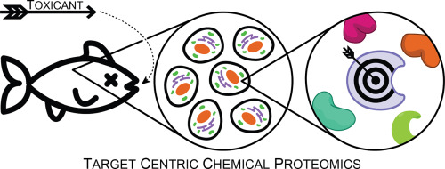

<!-- 

  Good references: 
    - example from U Sydney: https://github.com/garthtarr/sydney_xaringan
    - 
    
-->
    

```{r setup, include=FALSE}
options(htmltools.dir.version = FALSE)
knitr::opts_chunk$set(
  # fig.width=9, fig.height=3.5, fig.retina=3,
  # out.width = "100%",
  cache = FALSE,
  echo = FALSE,
  message = FALSE, 
  warning = FALSE,
  hiline = TRUE
)
```

```{r xaringan-themer, include=FALSE, warning=FALSE}
library(xaringanthemer)

# Colours

white     <- "#FFFFFF"
max_red   <- "#DE1A1A"
old_gold  <- "#E0BE36"
onyx      <- "#444545"
yale_blue <- "#274C77"


style_duo_accent(
  primary_color = onyx,
  secondary_color = yale_blue,
  inverse_header_color = old_gold,
  # fonts
  header_font_google = google_font("IBM Plex Sans Extralight"),
  text_font_google = google_font("IBM Plex Sans"),
  code_font_google = google_font("Fira Code"),
  # Positions
  padding = ("0px 40px 10px 20px"),
  # font sizes
  header_h1_font_size = "2rem",
  header_h2_font_size = "2rem",
  header_h3_font_size = "1.25rem"
)
```

```{r xaringan-tile-view, echo=FALSE}
library(xaringanExtra)
xaringanExtra::use_tile_view()
```


# Chemical Proteomics Methods for Elucidating the <br>Physical Protein Targets of Environmental Contaminants

.left-column[
<br>
<br>
### David Hall
### PhD Candidate
### Dec. 9, 2022
### 
]

<br>
<br>
.right[

]


---


# This is the first slide talking about interactions between chemicals...

.footnote[test]
.footnoteRight[test right<br>test2]


---

background-image: url(images/logos/embryo.png)
background-position: 90%, 100%
background-size: 5%

## Intro 1

---

## Intro 2: Commerncial and Env. chemicals might interact with proteins

<!-- # ```{r fig.align = 'center'} -->
<!-- # knitr::include_graphics(path = "images/lipinski-defence-talk.png") -->
<!-- # ``` -->
.center[
  
]

---

## proteins jiggle 


.pull-left[

]


--

.pull-right[

```{r, out.height = "400px", fig.align='center'}
knitr::include_graphics(path = "gifs/de_shaw_5.gif")
```
]

.footnoteRight[D.E. Shaw<br>Research (2022)]

---

## Proteomics is a thing

.center[

]
---


## Intro 4


---


## Intro 5


---


## Intro 6


---

## Intro 7

---
class: inverse 

# DBPs


---


## Water disinfection produces a slew of chemical by-products <br> which have been linked to adverse health outcomes

---

## Monohaloacetamides and monohaloacetic acids are some on of the most toxic DBPs. 

---


## Cellular assays

.center[

]

---


## ABPP protein targets

.center[

]

---

## Gels are a thing

.center[

]

---

## ABPP results 

.center[

]

---
layout: true

## Direct Adducts 

---

.center[

]

---

.center[ 

]

---

layout: false

## GAPDH results and illustration

.center[
  
  

]


---


## DBP conclusions


---
class: inverse center middle


# FSPE


---


## PFAS can form covalent addcuts with proteins; <br> the implications of such are unknown 

.pull-left[
Scheme of 8:2 FTAC
]
--
.pull-right[

.footnoteRight[Rand & Mabury <br><i>ES&T</i>, 2012]

]

---


## 8:2 Fluorotelomer acrylate can also undergo nucleophilic substition to form covalent thiol adducts

.pull-left[
scheme of 8:2 FTAC reactivity w/ BSA
]

.pull-right[
BSA peptides chromatogram plots 
]

---


## Low-signal of PFAS modified peptides requires selective enrichement to trigger MS2 events

.center[
FSPE enrichement scheme... include F13-IAM and globular protein stuff
]


---


## FSPE enriches very hydrophobic and PFAS modified peptides;<br> nLC further resolves these

.pull-left[
FSPE w/ BSA modified peptides 30% MeOH,  100% MeOH
]

.pull-right[
Figure 4.2D from thesis; nLC separation 
]
---

## FSPE enrichement reveals that 8:2 FTAC modifies <br> over 100 unnique proteins *in vitro*

.center[
image of 8:2 pfas modified peptides 
]

---

## 8:2 FTAC modified proteins are primarily soluble enzymes 


.center[
PANTHER protein class enrichement plot 
]
---

## Cysteine residues modified by 8:2 FTAC occur outside of binding pocket 

.center[
spinning gif of GADPH w/ labelled modified residues
]

---

## Of 100 proteins; 9 have anotated nucleophil;ic residiues,<br> none are modified by 8:2 FTAC

.center[
sequence plots
]

---


## PFAS modification decrease proteins solubility

.center[bar plot showing protein aggregations...]


---


## FSPE Conclusions


.pull-right[
FSPE scheme again
]

1. 8:2 FTAC can react w/ protein thiols

--

2. FSPE selectively enriches PFAS modified peptides

--

3. PFAS modifications occur outside of predicted regions 

--

4. PFAS modification decrease protein stability


---
class: inverse center middle


# 74 PFAS ELS Zebrafish


---
background-image: url("images/zebrafish_embryo.jpg")
background-size: cover

.inverse-

## ELS zebrafish 

---
background-image: url("images/74PFAS.png")
background-size: cover

## 74 PFAS Project

---


## 74 PFAS Tox results


---


## DIA proteomics scheme
.center[

]
split this image into two parts; pull right/left for DIA/DDA stuff. 
---

## 

---
class: inverse center middle

# Conclusion


