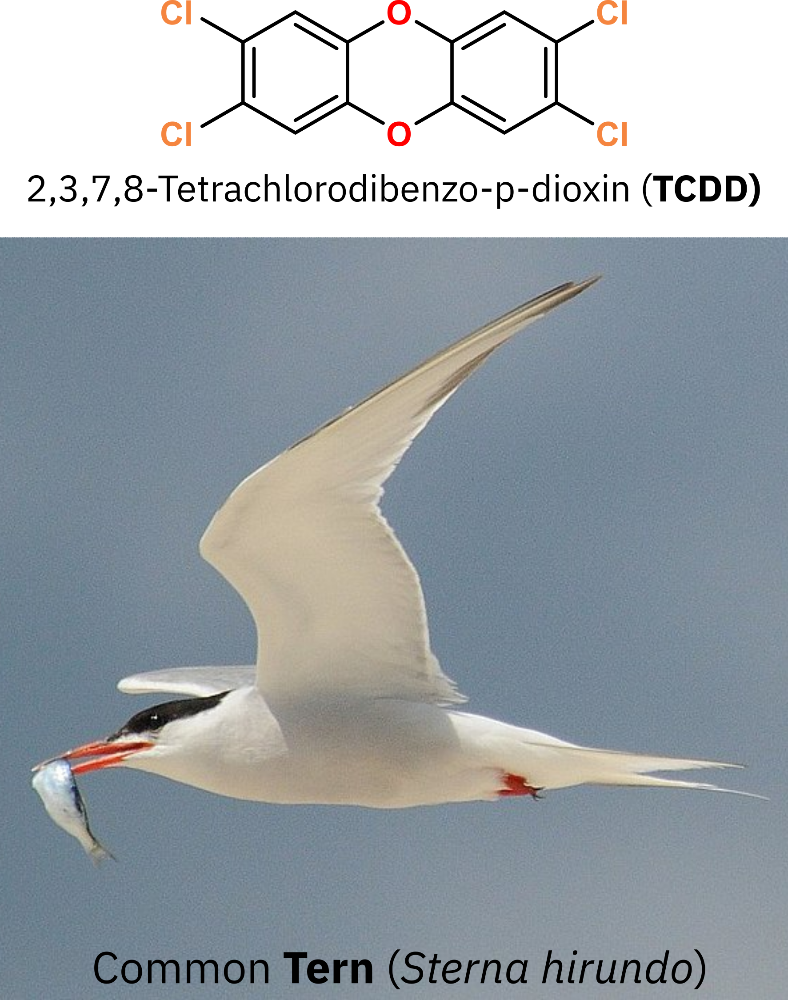
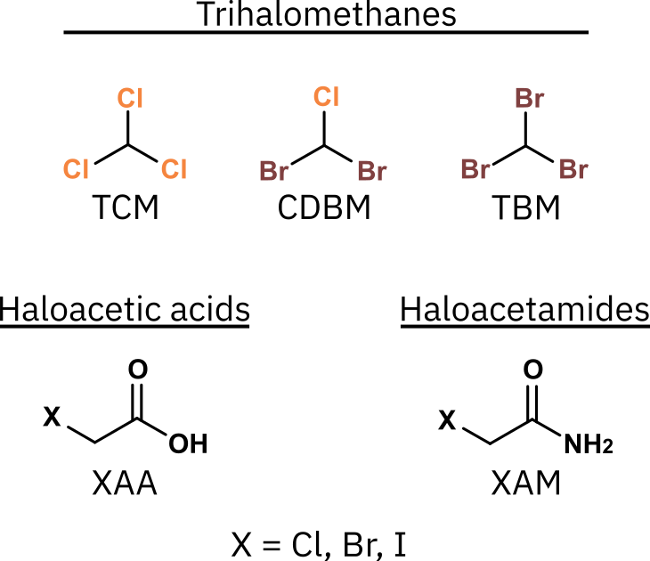
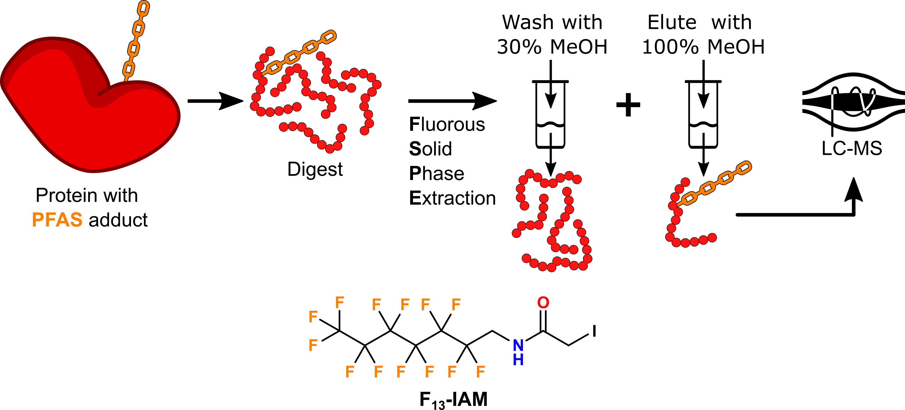
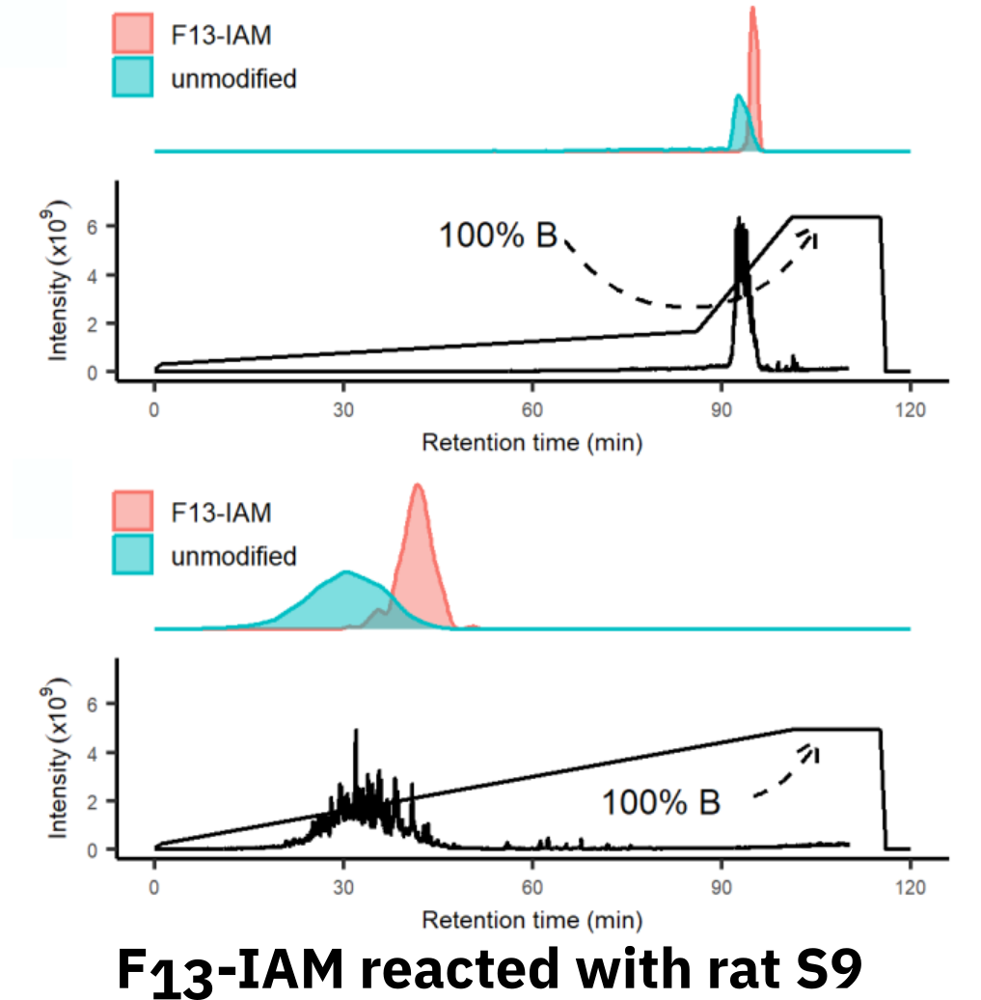

<!-- 

  Good references: 
    - example from U Sydney: https://github.com/garthtarr/sydney_xaringan
    - 
    
-->
    

```{r setup, include=FALSE}
options(htmltools.dir.version = FALSE)
knitr::opts_chunk$set(
  # fig.width=9, fig.height=3.5, fig.retina=3,
  # out.width = "100%",
  cache = FALSE,
  echo = FALSE,
  message = FALSE, 
  warning = FALSE,
  hiline = TRUE
)
```

```{r xaringan-themer, include=FALSE, warning=FALSE}
library(xaringanthemer)

# Colours

white     <- "#FFFFFF"
max_red   <- "#DE1A1A"
old_gold  <- "#E0BE36"
onyx      <- "#444545"
yale_blue <- "#274C77"
powder_blue <- "#BFEDEF"

light_grey <- "#E0E0E0" #"#D3D3D3"
steel_blue <- "#3E7CB1"
rich_black <- "#051014"
safety_orange <- "#F17300"
maroon <- "#A13D63"
hookers_green <- "#567568"


style_duo(
  #colours  
  primary_color = light_grey,
  secondary_color = "#F17300",
  inverse_header_color = "#051014",
  header_color = "#051014",
  inverse_text_color = "light_grey",
  # fonts
  header_font_google = google_font("IBM Plex Sans Extralight"),
  text_font_google = google_font("IBM Plex Sans"),
  code_font_google = google_font("Fira Code"),
  # Positions
  #padding = ("0px 40px 10px 20px"),
  # font sizes
  header_h1_font_size = "2rem",
  header_h2_font_size = "2rem",
  header_h3_font_size = "1.25rem",
  
)
```


```{r xaringan-tile-view, echo=FALSE}
library(xaringanExtra)
xaringanExtra::use_tile_view()
```

# Chemical Proteomics Methods for Elucidating the <br>Physical Protein Targets of Environmental Contaminants

.left-column[
<br>
<br>
### **David Hall**
### PhD Candidate
### Dec. 9, 2022
### 
]

<br>
<br>
.right[

]


---
class: inverse
background-image: url(images/01-intro/canary.webp)
background-size: contain
background-color: #000000

.footnoteRight[[G. McCaa<br>USBM](https://www.smithsonianmag.com/smart-news/story-real-canary-coal-mine-180961570/)]

???

- Talk about canary in coal mine, and hx of humans using animals 

---
class: inverse
background-image: url(images/01-intro/lozenge.jpg)
background-size: contain
background-color: #000000

.footnoteRight[[J. Leech<br><i>Punch</i> , 1858](https://en.m.wikipedia.org/wiki/File:The_Great_Lozenge-Maker_A_Hint_to_Paterfamilias.jpg)]

???

- Referring to the 1858 Bradford sweet poisoning where sweets accidentally made w/ arsenic killed > 200 people
- Lead to the Pharmacy Act of 1868, limiting sales of poisons and drugs to qualified pharmacists 

---
class: inverse
background-image: url(images/01-intro/squad.jpg)
background-size: contain
background-color: #000000

.footnoteRight[[PBS Wisconsin<br>(2020)](https://pbswisconsin.org/article/qa-deborah-blum-the-poison-squad-on-american-experience/)]

???

- *Poison Squad*, a group of 12 volunteers who in **1901** set out to test the effects of chemical food preservatives using human trials
- This led to the development of the FDA (U.S. Food and Drug Administration)  


---
class: inverse
background-image: url(images/01-intro/rabbits.jpg)
background-size: contain
background-color: #000000

.footnoteRight[[BBC UK <br>(1999)](https://www.bbc.co.uk/sounds/play/p00545f8)]

???

- Draize test developed in 1944 at US FDA
- Initially use for cosmetics, but expanded to other compounds
- Topical application of suspected irritant, observed 14 days
- Still in use today, but *in vitro* test screen out severe irritants

---
class: inverse
background-image: url(images/01-intro/tox-testing.webp)
background-size: contain
background-color: #000000

.footnoteRight[[Caven<br>Images <br>(2021)](https://www.nature.com/articles/d43978-021-00009-6)]

???
- Modern assessments still employ animal testing
- Triaged using *in vitro* screening; lower doses; and lower endpoints 

---

class: center, middle

## Traditional animal-based toxicicty/risk assessment<br>faces three major hurdles. 


---

## Throughput of animal testing cannot cope with the >350 000 chemicals and mixtures registered for production & use 

.center[
  .hide-bg[
```{r, out.width="80%", echo = FALSE}
knitr::include_graphics("images/01-intro/want-est-2020.jpeg")
```
  ]
]

.footnoteRight[[Wang, et al.<br><i>ES&T</i> 2020](https://pubs.acs.org/doi/10.1021/acs.est.9b06379)]
---

## The majority of chemicals in use satisfy some elements of "drug-likeness"; indicating they may be bioactive

.center[
  .hide-bg[
   
  ]
]
.footnoteRight[[Data from<br>TSCA](https://pubs.acs.org/doi/10.1021/acs.est.9b06379)]

???

- Lipinski's rule of 5: < 500 Da, 0 < LogP < 5,<=5 hydrogen bond donors, <= 10 Hydrogen bond acceptors (N, O)
- ~ 35 000 compounds inside the box
- Not a large pool compared to pharmaceutical screening, 
- Not concerned with something good happening (i.e. pharma); only concerned if something bad happens...

---

## Animal testing fails to elucidate *molecular* mechanisms of toxicity; critical for adverse outcome pathway development

.hide-bg[
  .center[
```{r, out.width="88%", echo = FALSE}
knitr::include_graphics("images/01-intro/aop.png")
```
  ]
]

.footnoteRight[[Ankley et al.<br><i>Env. Tox. &<br>Chem.</i> 2009](https://www.pnas.org/doi/10.1073/pnas.0509950103)]

---

## Single species testing does not reflect interspecies<br>variation in toxic response (or lack thereof)

???

- Implicitly understood
  - Dog vs. human response to chocolate
- TCDD extremely toxic, but Terns are 80- to 250-fold less sensitive to compared to Chickens
- Variance in two amino acid residues in the aromatic hydrocarbon receptor (AHR) ligand-binding domain (LBD) that account for the differences in AHR function, and thus contribute to the species differences in sensitivity to HAHs.
--
.pull-left[
  
]
.footnote[[Wikimedia Commons](https://en.wikipedia.org/wiki/File:Common_tern_with_fish.jpg)]
--

.hide-bg[
  .pull-right[  
```{r, out.width="80%", echo = FALSE}
knitr::include_graphics("images/01-intro/ahr.png")
```
  ]
]

.footnoteRight[[Karchner, et al.<br><i>PNAS</i> 2006](https://www.pnas.org/doi/10.1073/pnas.0509950103)]

---
class: inverse middle center
background-image: url(images/01-intro/cell.png
background-size: cover

.footnoteRight[[Digizyme<br>2020](https://www.digizyme.com/cst_landscapes.html)]

--
<!-- ## <mark style="background-color: #F17300; color:black;padding: 0px 5px 5px 5px;">Finding small-molecule/protein interactions is worse then finding a neede in a haystack </mark> -->

---
<!--## proteins jiggle 


.pull-left[

]


--
.hide-bg[
.pull-right[

```{r, out.height = "400px", fig.align='center'}
knitr::include_graphics(path = "gifs/de_shaw_5.gif")
```
]
]
.footnoteRight[D.E. Shaw<br>Research (2022)] -->


## Bottom-up proteomics uses LC-MS to measure peptides and compares them to genomic informaiton to detect proteins


.hide-bg[
  .center[
```{r, out.width="90%", echo = FALSE}
knitr::include_graphics("images/01-intro/proteomics.png")
```
  ]
]


---

## During my PhD research, I've developped proteomic methods to explore environmental chemical/protein interactions

.center[

]


---

class: inverse
# Monohaloacetic Acids and Monohaloacetamides Attack Distinct Cellular Proteome Thiols

.left-column[
<br>
<br>
### <mark style="background-color: #F17300; color:black;">David Hall, Kirsten Yeung, and Hui Peng </mark>
#### <mark style="background-color: #F17300; color:black;">Published in *ES&T*, 2022, 54, 23, 15191-15201, </mark>
### 
]

<br>
<br>
.right[

]

---

## Long-term consumption of water disinfected via chlorination is linked to increased incidences of bladder cancer

.hide-bg[
.center[

]
]
.footnoteRight[[Hrudey<br>2009](https://www.sciencedirect.com/science/article/pii/S0043135409000943?via%3Dihub#fig4)]

---

## The byproducts produced during water disinfection<br>are the suspected culprits 

.center[

]
---

## There is a large gap is toxicity between<br>regulated and unregulated DBPs
.footnote[[remake this figure, but trim it down](https://pubs.acs.org/doi/10.1021/acs.accounts.8b00641)]
.center[

]
<!-- get CHO cytoxicuty date here: https://www.sciencedirect.com/science/article/pii/S1001074217303285 -->
---

## Cellular assays


.hide-bg[
  .center[
    
  ]   
]
---


## I developped an approach using activity-based protein profilling to identify targets of mHAAs and mHAAs


.hide-bg[
  .center[

  ]
]

---

## In crude lysate the general trends of I>Br>Cl cystein reactivity is preserved; in live cells specific protein targets appear

.hide-bg[
  .center[
    
  ]
]
---

## Biotin-affinity LC-MS analysis reveals compound<br> and class specific proteint targets 

<!-- if possible remake figures w/ different colours so I can remove background -->

.hide-bg[
.center[

]
]
---
## Direct adduct monitoring directly validated many of the suspected targets of IAM and IAA

.hide-bg[
.center[ 

]
]
---

## IAM, and not IAA, specifically binds to <br>the active site Cys152 on GAPDH

.hide-bg[
.center[

]
]

<!-- remove the chromatogram elements of this figure and only talk about the active site-->
<!-- come up with a better title -->
---


## DBP conclusions

<!-- come up with cleaner conclusions --> 

.pull-left[

1. Class and Compound specific Differences in DBP protein targets
2. Differences in toxicity responses can be accounted for by protein targets
3. Cys reactivity used to fish for reactive DBPs (Hi Kirsten 👋)
]

.pull-right[

]


---

background-color: #C2D6EB

# Querying the Upper-Bounds of Long-Chain PFAS reactions with Proteomic Thiols

.left-column[
<br>
<br>
### <p style="color:black;">David Hall, Jeremy Gauthier, and Hui Peng </p>
 
]

<br>
<br>
.right[

]

---

## PFAS such can form covalent adducts with proteins; <br> the implications of such are unknown 

.pull-left[

]
.footnoteLeft[[Rand & Mabury<br>(2012)](https://link.springer.com/article/10.1007/s10565-012-9211-4)]
--
.hide-bg[
.pull-right[


]
]
.footnoteRight[[Rand & Mabury <br><i>ES&T</i>, 2012](https://pubs.acs.org/doi/10.1021/es303760u)]
---

## 8:2 Fluorotelomer acrylate can also undergo nucleophilic substition to form covalent thiol adducts

.pull-left[

]

.pull-right[
.hide-bg[

]
]

---

## 8:2 FTAC adducts can survive digestion, but low-signal of modified peptides requires enrichement to trigger MS2 events

.center[
.hide-bg[

]
]
---

## Fluorous Solid Phase Extraction can selectively enrich peptides with long-chain PFAS adduct

.center[

]

---

## FSPE enriches very hydrophobic and PFAS modified peptides <br> which can be further resolves using C18 nLC
.pull-left[
.hide-bg[

]
]

--

.pull-right[
.hide-bg[

]
]
---

## FSPE enrichement of 8:2 FTAC reacted crude cell lysate helps identify over 100 unique modified proteins

.hide-bg[
.center[

]
]

.footnote[8:2 FTAC (100 µm)<br>with crude cell<br>lysate for 12 hrs]
---

## 8:2 FTAC modified proteins are primarily soluble enzymes 

.hide-bg[
.center[

]
]
---

## Cysteine residues modified by 8:2 FTAC occur outside of binding pocket 


.center[

]
.footnoteRight[[P04406<br>AlphaFold](https://alphafold.ebi.ac.uk/entry/P04406)]

---

## Of 110 proteins; 9 have anotated nucleophilic residiues,<br> none are modified by 8:2 FTAC
<!-- get exact number of proteins -->
.hide-bg[
.center[

]
]
---


## Increasing PFAS reactivity promotes protein aggregation<br>and decreases protein solubility

.hide-bg[
.center[

]
]
.footnote[100 µM PFAS<br>n = 4 per sample<br>representative of 3 experiments]
---


## FSPE Conclusions

.pull-left[

1. 8:2 FTAC does react with protein thiols

2. **FSPE** selectively enriches PFAS modified peptides

3. PFAS modifications occur outside of predicted regions 

4. PFAS modification decreases protein stability
]


.pull-right[

]


---
class: inverse 
background-color: #9BA2FF
# ToxicoProteomics Atlas of Perand Polyfluoroalkyl Substances in Early-Life Stages Zebrafish (*Danio rerio*)

.left-column[
<br>
<br>
### <p style="color:black;">David Hall, Jiajun Han, Wen Gu, Diwen Yang, and Hui Peng </p>

###  
### 
]

<br>
<br>
.right[


]
---
background-image: url("images/05-74PFAS/74PFAS.png")
background-size: cover

.footnoteRight[[Patlewicz, et al.<br><i>EHP</i> 2019<br> ](https://ehp.niehs.nih.gov/doi/10.1289/EHP4555)]

## PFAS exhibit surprising structural diversity

---

background-image: url("images/05-74PFAS/zebrafish_embryo.jpg")
background-size: cover

.footnoteLeft[[Cavanagh &<br>McCarthy, 2014](https://ki-images.mit.edu/2014/wellcome)]

---

## Fish Embryo Toxicity testing for is logistically simple<br>and sensitive to acute toxicity

.center[
.hide-bg[

]
]

.footnoteRight[[Test No. 236<br>OECD, 2013](https://doi.org/10.1787/9789264203709-en )]
---

## Traditional fish embryo toxicity endpoints are poor predictors of weak acute and sublethal toxicities

.hide-bg[
.center[

]
]

.footnoteRight[[Han et al.<br><i>EHP</i>, 2021](https://ehp.niehs.nih.gov/doi/10.1289/EHP7169)]
---

## Low- and high-con

.hide-bg[
.center[

]
]
---

## Data Independent Acquisition(DIA) captures  more information compared to Data-Dependant Acquisition (DDA)

.pull-left[

]

--

.pull-right[

]

---

##  DIA + DIA-NN outperforms DDA + MaxQuant in coverage, intra-run and inter-run data completeness

.hide-bg[
.center[

]
]

---

## Global proteome response to PFAS exposure belies chemical classification, suggesting more complex mechanisms

.hide-bg[
.center[

]
]

---

## Largest dataset is available online, for other people....

- shiny app data base
- aop checking stuff over
- exploring differences in 24 and 16

---
class: inverse center middle

# Conclusion

---

## stuff to add

- figure from review paper & publicatiosn since then 
- alpha fold stuff w/ interspecies 
- future work for shit. 

