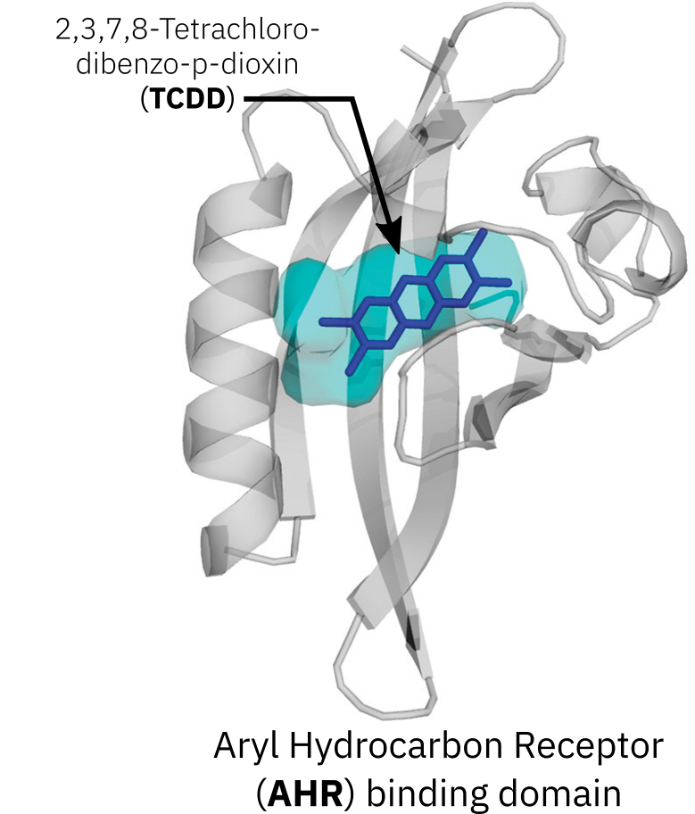
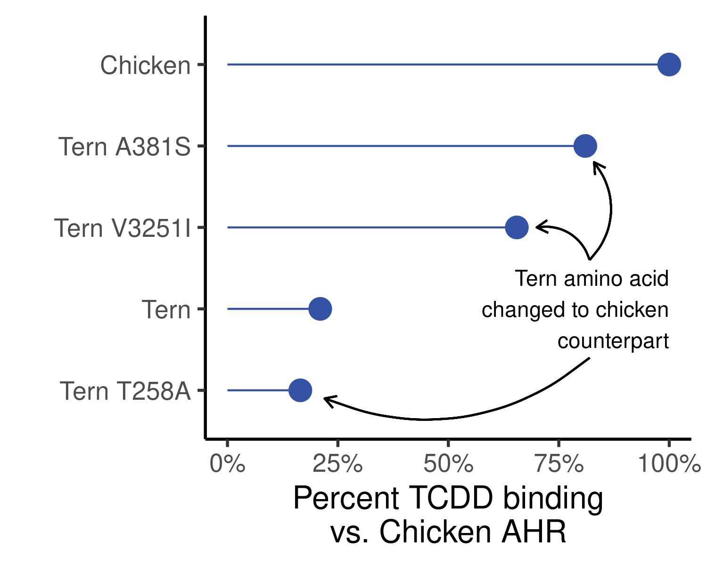
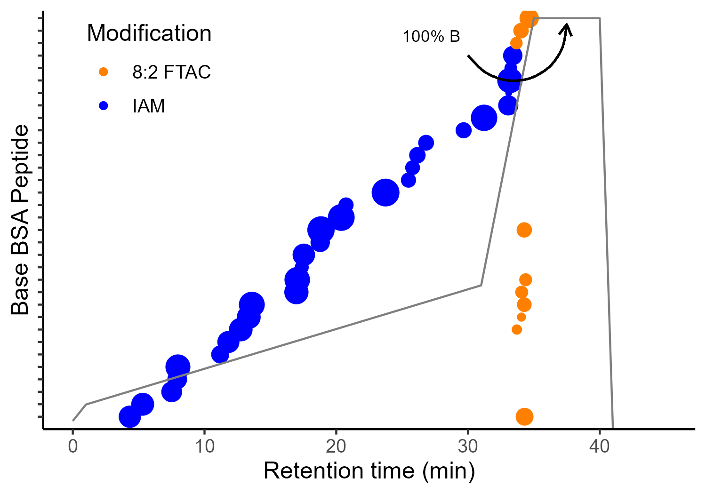

<!-- 

  Good references: 
    - example from U Sydney: https://github.com/garthtarr/sydney_xaringan
    - 
    
-->
    

```{r setup, include=FALSE}
options(htmltools.dir.version = FALSE)
knitr::opts_chunk$set(
  # fig.width=9, fig.height=3.5, fig.retina=3,
  # out.width = "100%",
  cache = FALSE,
  echo = FALSE,
  message = FALSE, 
  warning = FALSE,
  hiline = TRUE
)
```

```{r xaringan-themer, include=FALSE, warning=FALSE}
library(xaringanthemer)

# Colours

light_grey <- "#E0E0E0" #"#D3D3D3"
rich_black <- "#051014"
safety_orange <- "#F17300"

style_duo_accent(
  #colours  
  primary_color = rich_black,
  secondary_color = safety_orange ,
  white_color = light_grey,
  inverse_header_color = rich_black,
  header_color = rich_black,
  text_color = rich_black,
  inverse_text_color = rich_black,
  footnote_color = rich_black,
  link_color = safety_orange ,
  # fonts
  header_font_google = google_font("IBM Plex Sans Extralight"),
  text_font_google = google_font("IBM Plex Sans"),
  code_font_google = google_font("Fira Code"),
  # Positions
  #padding = ("0px 40px 10px 20px"),
  # font sizes
  header_h1_font_size = "2rem",
  header_h2_font_size = "1.5rem",
  header_h3_font_size = "1.25rem",
  
)
```


```{r xaringan-tile-view, echo=FALSE}
library(xaringanExtra)
xaringanExtra::use_tile_view()
```

# Chemical Proteomics Methods for Elucidating the <br>Physical Protein Targets of Environmental Contaminants

.left-column[
<br>
<br>
## **David Hall**
## Final Oral Exam
## Dec. 9, 2022
## 
]

.footnoteLeft[Slides available here: .my-bold[[davidrosshall.github.io/phd-defence-talk](https://davidrosshall.github.io/phd-defence-talk/#1)]]

<br>
<br>
.right[

]


---
class: inverse
background-image: url(images/01-intro/canary.webp)
background-size: contain
background-color: #000000

.footnoteRight[[G. McCaa<br>USBM](https://www.smithsonianmag.com/smart-news/story-real-canary-coal-mine-180961570/)]

???

- Talk about canary in coal mine, and hx of humans using animals 

---
class: inverse
background-image: url(images/01-intro/lozenge.jpg)
background-size: contain
background-color: #000000

.footnoteRight[[J. Leech<br><i>Punch</i> , 1858](https://en.m.wikipedia.org/wiki/File:The_Great_Lozenge-Maker_A_Hint_to_Paterfamilias.jpg)]

???

- Referring to the 1858 Bradford sweet poisoning where sweets accidentally made w/ arsenic killed > 200 people
- Lead to the Pharmacy Act of 1868, limiting sales of poisons and drugs to qualified pharmacists 

---
class: inverse
background-image: url(images/01-intro/squad.jpg)
background-size: contain
background-color: #000000

.footnoteRight[[PBS Wisconsin<br>(2020)](https://pbswisconsin.org/article/qa-deborah-blum-the-poison-squad-on-american-experience/)]

???

- *Poison Squad*, a group of 12 volunteers who in **1901** set out to test the effects of chemical food preservatives using human trials
- This led to the development of the FDA (U.S. Food and Drug Administration)  


---
class: inverse
background-image: url(images/01-intro/rabbits.jpg)
background-size: contain
background-color: #000000

.footnoteRight[[BBC UK<br>(1999)](https://www.bbc.co.uk/sounds/play/p00545f8)]

???

- Draize test developed in 1944 at US FDA
- Initially use for cosmetics, but expanded to other compounds
- Topical application of suspected irritant, observed 14 days
- Still in use today, but *in vitro* test screen out severe irritants

---
class: inverse
background-image: url(images/01-intro/tox-testing.webp)
background-size: contain
background-color: #000000

.footnoteRight[[Caven<br>Images<br>(2021)](https://www.nature.com/articles/d43978-021-00009-6)]

???
- Modern assessments still employ animal testing
- Triaged using *in vitro* screening; lower doses; and lower endpoints 

---

class: center, middle

# Traditional animal-based toxicity/risk assessments<br>faces <u>two major obstacles</u> 

---

# <u>Problem 1</u>: The throughput of animal-based testing cannot cope with the number of chemicals in use 

.center[
  .hide-bg[
```{r, out.width="80%", echo = FALSE}
knitr::include_graphics("images/01-intro/want-est-2020.jpeg")
```
  ]
]

.footnoteRight[[Wang, et al.<br><i>ES&T</i> 2020](https://pubs.acs.org/doi/10.1021/acs.est.9b06379)]

???

- < 5000 have been undergone any testing (Lancet 2019)
- Testing requires days to analyze samples 
  - 14 days observations
  - one chemical at a time

---

# <u>Problem 2</u>: Single species testing does not reflect<br>interspecies variation in toxic response(s) 

.hide-bg[
.center[

]
]


.footnoteRight[[Data from<br>Kennedy<br>et al., 1996](https://www.sciencedirect.com/science/article/pii/S0041008X96800275)]
---

# AOPs can address these issues, but animal testing fails to elucidate *molecular* mechanisms of toxicity

.hide-bg[
  .center[
```{r, out.width="80%", echo = FALSE}
knitr::include_graphics("images/01-intro/aop.png")
```
  ]
]

.footnoteRight[[Ankley et al.<br><i>Env. Tox. &<br>Chem.</i> 2010](https://setac.onlinelibrary.wiley.com/doi/10.1002/etc.34)]

---

# Small differences in protein structure can account for large disparities in interspecies toxicity

.hide-bg[
.pull-left[
]]

.footnoteLeft[[Pandini et al.<br>*Biochemistry*<br> 2009](https://pubs.acs.org/doi/10.1021/bi900259z)]

--

.hide-bg[
.pull-right[  

]
]

.footnoteRight[[Karchner et al.<br><i>PNAS</i> 2006](https://www.pnas.org/doi/10.1073/pnas.0509950103)]


---
class: inverse middle center
background-image: url(images/01-intro/cell.png
background-size: cover

.footnoteRight[[Digizyme<br>2020](https://www.digizyme.com/cst_landscapes.html)]

???

- Metaphor of repairing car (blueprints = genomes, metabolites = leaking, proteins = looking at the parts). 
- maybe make it multiple slides... 

---

# The identification and quantification of thousands of proteins is possible via LC-MS proteomics

.hide-bg[
  .center[
```{r, out.width="90%", echo = FALSE}
knitr::include_graphics("images/01-intro/proteomics.png")
```
  ]
]

---

# Expression proteomics is a survey of the proteome whereas chemical proteomics IDs chemical-protein interactions 

.pull-left[

- **Generalized** sample prep
- **High** throughput
- **Global proteome** profiles
]

.pull-right[

- **Specialized** sample prep
- **Low** throughput
- **Chemical-protein** interactions
]

---

# During my PhD, I've developed proteomic methods to explore environmental chemical/protein interactions

.center[

]


---


# .my-bold[Project 1]: Profilling Proteome  Thiol Reactivity of Monohaloacetic Acids and Monohaloacetamides 
.left-column[
<br>
<br>
## <p style="color:black;">David Hall, Kirsten Yeung, and Hui Peng </p>
### Published in [*ES&T*, 2020, 54, 23, 15191-15201](https://pubs.acs.org/doi/10.1021/acs.est.0c03144)
## 
]

<br>
<br>
.right[

]

---

# Long-term consumption of chlorinated water is epidemiologically linked to bladder cancer

.hide-bg[
.center[

]
]
.footnoteRight[[Data from<br>Hrudey<br>2009](https://www.sciencedirect.com/science/article/pii/S0043135409000943?via%3Dihub#fig4)]

---

# Adverse health outcomes of chlorinated water are caused by halogenated disinfection byproducts 

.center[

]
.footnoteRight[.my-bold[[THMs](https://www.canada.ca/en/health-canada/services/publications/healthy-living/guidelines-canadian-drinking-water-quality-trihalomethanes.html)] and .my-bold[[HAA5](https://www.canada.ca/en/health-canada/services/publications/healthy-living/guidelines-canadian-drinking-water-quality-guideline-technical-document-haloacetic-acids.html)] are <br>regulated in Canada]
---

# HAM and HAA geno- and cyto-toxicity is purportedly due to their reactivity with, potentially critical, cystein residues 

.pull-left[

]

.footnoteLeft[[Dong et al.<br>*ES&T*, 2018](http://pubs.acs.org/doi/10.1021/acs.est.8b01675)]

--

.pull-right[

]

.footnoteRight[[Marina & Gladyshev<br> *JBC*, 2012]()]

<!-- get CHO cytoxicuty date here: https://www.sciencedirect.com/science/article/pii/S1001074217303285 -->
---

# Order of DBP cytoxicity is I > Br >> Cl,<br>but only HAMS induce Nrf2 oxidatiative stress

.hide-bg[
.center[

]   
]
.footnoteLeft[**AA** = acetic acid<br>**AM** = acetamide]
---

# I developed an activity-based protein profiling method to identify the protein targets of mHAAs and mHAMs

.hide-bg[
  .center[

  ]
]

---

# Biotin-affinity LC-MS analysis reveals compound<br> and class specific protein targets 

<!-- if possible remake figures w/ different colours so I can remove background -->

.hide-bg[
.center[

]
]

---
# Direct adduct monitoring directly validated many of the suspected targets of IAM and IAA

.hide-bg[
.center[ 

]
]

.footenoteLeft[**NEM** = N-ethylmaleimide]

---

# Direct adduct monitoring provides binding-site information such as selective modification of Cys152 on GAPDH
.center[

]
.footnoteRight[[P04406<br>AlphaFold](https://alphafold.ebi.ac.uk/entry/P04406)]
.footenoteLeft[**IAM** = iodoacetamide<br>**IAA** = iodoacetic acid]


---

# mHAMs preferentially react with redox proteins accounting for their stronger Nrf2-mediated oxidative stress responses

.hide-bg[
.pull-left[

]
]
.footnoteLeft[Enrichment analysis<br>from ABPP results]

.hide-bg[
.pull-right[

]
]

.footnoteRight[**GAPDH** = Glyceraldehyde-3-phosphate dehydrogenase<br>**SOD1** = Superoxide dismutase [Cu-Zn]<br>[Pals et al. *ES&T* 2011](https://pubs.acs.org/doi/10.1021/es2008159)]

---


# .my-bold[Project 1]: Conclusions

<!-- come up with cleaner conclusions --> 

.pull-left[


1. Class and compound specific differences in DBP cytotoxicity

1. ABPP and adduct monitoring can readily identify DBP protein targets

1. Differences in toxicity responses can be accounted for by variation in protein targets

]

.pull-right[

]


---

# .my-bold[Project 2]: Development of Fluorous Solid Phase Extraction for the Enrichement of Long-Chain PFAS modified peptides

.left-column[
<br>
<br>
## <p style="color:black;">David Hall, Jeremy Gauthier, and Hui Peng </p>
 
]  

<br>
<br>
.right[

]

---

# Biotransformation of 8:2 FTOH can form covalent adducts with glutathione and cysteine residues

.center[

]

.footnoteRight[[Rand & Mabury<br> *Cell Biol. Toxicol.* (2012)](https://link.springer.com/article/10.1007/s10565-012-9211-4)<br>[Rand & Mabury <br><i>ES&T</i> (2012)](https://pubs.acs.org/doi/10.1021/es303760u)]
---

# 8:2 FTAC can also form covalant adducts with glutathione

.pull-left[

]

.footnoteLeft[**GSH** = glutathione]

--

.pull-right[
.hide-bg[

]
]

---

# Low-intensity and overlapping retention times of 8:2 FTAC modified peptides hampers detection

<!--adjust label on y-axis to state "Cysteine containing peptide" --> 

.center[
.hide-bg[

]
]

.footnoteLeft[**BSA** = Bovine<br>Serum Albumin<br>**IAM** = iodoacetamide]
---

# To selectively enrich long-chain PFAS adducted peptides I refined existing Fluorous Solid Phase Extraction methods

.center[

]

.footnoteRight[[Based on<br> Brittain<br>et al. 2005](http://www.nature.com/doifinder/10.1038/nbt1076)]

---

# FSPE enriches very hydrophobic and PFAS modified peptides which can be further resolved using C18 nLC
.pull-left[
.hide-bg[

]
]

--

.pull-right[
.hide-bg[

]
]
---

# FSPE enrichement helped to identify<br>over 107 proteins modified by 8:2 FTAC

.hide-bg[
.center[

]
]

.footnoteRight[8:2 FTAC (100 µm)<br>with crude Hep G2<br>cell lysate (N = 4)<br>for 12 hrs<br><br>]

---

# 8:2 FTAC only modifies GAPDH <mark style="background: #98FF98!important">Cys247</mark> and <br>not the catalytic <mark style="background: #ADFF2F!important">Cys152</mark> residue 

.center[

]
.footnoteLeft[**GAPDH** = Glyceraldehyde 3-phosphate dehydrogenase]
.footnoteRight[[P04406<br>AlphaFold](https://alphafold.ebi.ac.uk/entry/P04406)]

???

- Modification of Cys247 (& GAPDH inactivation) by 4-Hydroxy-2-nonenal

---

# Only 9 of 107 8:2 FTAC modified proteins have annoated nucleophilic residues, none of which are modified
<!-- get exact number of proteins -->
.hide-bg[
.center[

]
]
---


# 8:2 FTAC adducts promote protein aggregation<br>in *in vitro* crude cell lysate

.hide-bg[
.center[

]
]
.footnote[100 µM PFAS<br>n = 4 per sample]
---


# .my-bold[Project 2]: Conclusions

.pull-left[

1. 8:2 FTAC does react with protein thiols

2. FSPE selectively enriches peptides with long-chain PFAS modifications

3. PFAS modifications occur outside of predicted regions 

4. PFAS modification decreases protein stability
]


.pull-right[

]
---

# .my-bold[Project 3]: Toxicoproteomics Atlas of Per- and Polyfluoroalkyl Substances in Early-Life Stages Zebrafish (*Danio rerio*)

.left-column[
<br>
<br>
## <p style="color:black;">David Hall, Jiajun Han, Wen Gu, Diwen Yang, and Hui Peng </p>

##  
## 
]

<br>
<br>
.right[


]
---

background-image: url("images/05-74PFAS/74PFAS.png")
background-size: cover

# PFAS are a structurally diverse class of compounds

.footnoteRight[[Patlewicz, et al.<br><i>EHP</i> 2019<br><br> ](https://ehp.niehs.nih.gov/doi/10.1289/EHP4555)]

---

background-image: url("images/05-74PFAS/zebrafish_embryo_1hpf.png")
background-size: contain
background-color: #d3e7dc

.right[
# <span style="color: #000000">1 *hpf*</span>
]

.footnoteRight[[IMP<br>Vienna<br>Biocenter<br>](https://phys.org/news/2021-03-egg-embryo-zebrafish-rna.html)]

---
background-image: url("images/05-74PFAS/zebrafish_embryo.jpg")
background-size: cover

.right[
# <span style="color: #F17300">120 *hpf*</span>
]
.footnoteRight[[Cavanagh &<br>McCarthy, 2014](https://ki-images.mit.edu/2014/wellcome)]

---

# Traditional fish embryo toxicity endpoints are poor predictors of weak acute and sublethal toxicities

.hide-bg[
.center[

]
]

.footnoteRight[[Han et al.<br><i>EHP</i>, 2021](https://ehp.niehs.nih.gov/doi/10.1289/EHP7169)]

---

# Multiplexing exposure proteomic samples reduces<br>instrument time and improves quantification

.hide-bg[
.center[

]
]

.footnoteRight[[DIA-NN software<br> created by V. Demichev,<br>*Nature Methods* 2020](https://www.nature.com/articles/s41592-019-0638-x)]

---

# DIA aquisition captures more information than standard DDA, but at the cost of increased data complexity

.pull-left[

]

--

.pull-right[

]

---

# Reanalysis of identifical samples shows DIA outperforms DDA in coverage and data completeness
.hide-bg[
.center[

]
]

---
class: middle center

## ELS zebrafish exposures to .my-bold[74 PFAS at two concentrations].

--

## .my-bold[666 exposure samples] multiplexed into 222 LC-MS samples.

--
## 60 days of instrument time producing .my-bold[1217 GB of data].

--
## Over .my-bold[10 million sequenced peptides].  

--

## Relative quantification of .my-bold[1969 proteins] across all exposures.

---


# Proteome response to PFAS exposure belies chemical classification, suggesting more complex mechanisms

.hide-bg[
.center[

]
]

.footnoteLeft[5 µM PFAS results<br> **PFAS 60** ommitted due to<br>100% mortality]

---

# Despite similarties in chemical structure and proteome responses, sulfonamides have divergent rates of mortality


.center[

]

.footnoteLeft[5 µM PFAS results<br> **PFAS 60** ommitted due to<br>100% mortality]

---


# .my-bold[Project 3]: Conclusions

.pull-left[


1. DIA proteomics + ELS zebrafish exposure is adaptable to high-throughput screening

1. Toxicoproteomic response of PFAS exposure typically belies classification

1. Proteomics reveals insights into mechanisms not observable until many days/weeks post hatching

]


.pull-right[

]


---
# Concluding remarks for my PhD work

.center[
<br>
<br>
<br>
<br>

]

---

# Concluding remarks for my PhD work

.pull-left[
<br>
<br>
- .my-bold[Project 1] demonstrated how chemical proteomics can elucidate mechanisms of toxicity
]
<br>
<br>
.pull-right[

]

---

# Concluding remarks for my PhD work

.pull-left[
<br>
<br>
- .my-bold[Project 1] demonstrated how chemical proteomics can elucidate mechanisms of toxicity

- .my-bold[Project 2] led to the development an a chemical proteomics approach to study long-chain PFAS protein adducts
]
<br>
<br>
.pull-right[

]

---

# Concluding remarks for my PhD work

.pull-left[
<br>
<br>
- .my-bold[Project 1] demonstrated how chemical proteomics can elucidate mechanisms of toxicity

- .my-bold[Project 2] led to the development an a chemical proteomics approach to study long-chain PFAS protein adducts

- .my-bold[Project 3] analyzed the proteome responses of 74 PFAS to create the largest toxicoproteomics dataset to date
]
 
<br>
<br>
.pull-right[

]

---

# Looking to the future, work should expand protoemics methods, and explore downstream insights

.hide-bg[
.center[

]
]

.footnoteLeft[[Tian et al. *Science* 2020](https://www.science.org/doi/10.1126/science.abd6951)<br>[Hartl et al. *Nature* 2011](https://www.nature.com/articles/nature10317)]
---
background-color: #000000


.pull-left[]
.pull-right[
.center[
]
]

---

background-color: #000000


.pull-left[
.center[


]
]

.pull-right[
.center[


]
]

---

# Chemical Proteomics Methods for Elucidating the <br>Physical Protein Targets of Environmental Contaminants

.left-column[
<br>
<br>
## Questions?


]
<br>
<br>
.right[

]
.footnoteLeft[Slides available here: .my-bold[[davidrosshall.github.io/phd-defence-talk](https://davidrosshall.github.io/phd-defence-talk/#1)]]
---
 
# SI: Entries in the 74 PFAS chemical library

```{r}
library(tidyverse)
library(DT)

pfas_table <- read_csv(file = "data/pfas_imgs.csv") 

DT::datatable(pfas_table,
                    escape = FALSE,
                    rownames= FALSE,
                    options = list(
                      scrollY = '400px',
                      paging = FALSE,
                      sScrollX = "100%",
                      scrollCollapse = TRUE
                                       )) 
```
 
 

