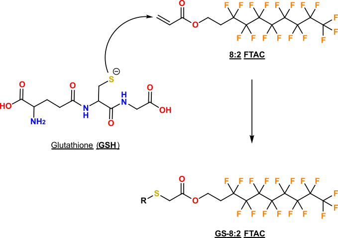

<!-- 

  Good references: 
    - example from U Sydney: https://github.com/garthtarr/sydney_xaringan
    - 
    
-->
    

```{r setup, include=FALSE}
options(htmltools.dir.version = FALSE)
knitr::opts_chunk$set(
  # fig.width=9, fig.height=3.5, fig.retina=3,
  # out.width = "100%",
  cache = FALSE,
  echo = FALSE,
  message = FALSE, 
  warning = FALSE,
  hiline = TRUE
)
```

```{r xaringan-themer, include=FALSE, warning=FALSE}
library(xaringanthemer)

# Colours

light_grey <- "#E0E0E0" #"#D3D3D3"
rich_black <- "#051014"
safety_orange <- "#F17300"

style_duo_accent(
  #colours  
  primary_color = rich_black,
  secondary_color = safety_orange ,
  white_color = light_grey,
  inverse_header_color = rich_black,
  header_color = rich_black,
  text_color = rich_black,
  inverse_text_color = rich_black,
  footnote_color = rich_black,
  link_color = safety_orange ,
  # fonts
  header_font_google = google_font("IBM Plex Sans Extralight"),
  text_font_google = google_font("IBM Plex Sans"),
  code_font_google = google_font("Fira Code"),
  # Positions
  #padding = ("0px 40px 10px 20px"),
  # font sizes
  header_h1_font_size = "2rem",
  header_h2_font_size = "1.5rem",
  header_h3_font_size = "1.25rem",
  
)
```


```{r xaringan-tile-view, echo=FALSE}
library(xaringanExtra)
xaringanExtra::use_tile_view()
```

# Chemical Proteomics Methods for Elucidating the <br>Physical Protein Targets of Environmental Contaminants

.left-column[
<br>
<br>
## **David Hall**
## PhD Candidate
## Dec. 9, 2022
## 
]

<br>
<br>
.right[

]


---
class: inverse
background-image: url(images/01-intro/canary.webp)
background-size: contain
background-color: #000000

.footnoteRight[[G. McCaa<br>USBM](https://www.smithsonianmag.com/smart-news/story-real-canary-coal-mine-180961570/)]

???

- Talk about canary in coal mine, and hx of humans using animals 

---
class: inverse
background-image: url(images/01-intro/lozenge.jpg)
background-size: contain
background-color: #000000

.footnoteRight[[J. Leech<br><i>Punch</i> , 1858](https://en.m.wikipedia.org/wiki/File:The_Great_Lozenge-Maker_A_Hint_to_Paterfamilias.jpg)]

???

- Referring to the 1858 Bradford sweet poisoning where sweets accidentally made w/ arsenic killed > 200 people
- Lead to the Pharmacy Act of 1868, limiting sales of poisons and drugs to qualified pharmacists 

---
class: inverse
background-image: url(images/01-intro/squad.jpg)
background-size: contain
background-color: #000000

.footnoteRight[[PBS Wisconsin<br>(2020)](https://pbswisconsin.org/article/qa-deborah-blum-the-poison-squad-on-american-experience/)]

???

- *Poison Squad*, a group of 12 volunteers who in **1901** set out to test the effects of chemical food preservatives using human trials
- This led to the development of the FDA (U.S. Food and Drug Administration)  


---
class: inverse
background-image: url(images/01-intro/rabbits.jpg)
background-size: contain
background-color: #000000

.footnoteRight[[BBC UK <br>(1999)](https://www.bbc.co.uk/sounds/play/p00545f8)]

???

- Draize test developed in 1944 at US FDA
- Initially use for cosmetics, but expanded to other compounds
- Topical application of suspected irritant, observed 14 days
- Still in use today, but *in vitro* test screen out severe irritants

---
class: inverse
background-image: url(images/01-intro/tox-testing.webp)
background-size: contain
background-color: #000000

.footnoteRight[[Caven<br>Images <br>(2021)](https://www.nature.com/articles/d43978-021-00009-6)]

???
- Modern assessments still employ animal testing
- Triaged using *in vitro* screening; lower doses; and lower endpoints 

---

class: center, middle

# Traditional animal-based toxicity/risk assessments<br>faces **two major problems** 

---

# Problem 1: the throughput of animal-based testing cannot cope with the number of chemicals in use 

.center[
  .hide-bg[
```{r, out.width="80%", echo = FALSE}

```
  ]
]

.footnoteRight[[Wang, et al.<br><i>ES&T</i> 2020](https://pubs.acs.org/doi/10.1021/acs.est.9b06379)]

???

- < 5000 have been undergone any testing (Lancet 2019)
- Testing requires days to analyze samples 
  - 14 days observations
  - one chemical at a time

---

# Problem 2: single species testing does not reflect<br>interspecies variation in toxic response(s) 

.hide-bg[
.center[

]
]


.footnoteRight[[Data from<br>Kennedy<br>et al., 1996](https://www.sciencedirect.com/science/article/pii/S0041008X96800275)]
---

# AOPs can address these issues, but animal testing fails to elucidate *molecular* mechanisms of toxicity

.hide-bg[
  .center[
```{r, out.width="80%", echo = FALSE}

```
  ]
]

.footnoteRight[[Ankley et al.<br><i>Env. Tox. &<br>Chem.</i> 2010](https://setac.onlinelibrary.wiley.com/doi/10.1002/etc.34)]

---

# Small differences in protein structure can account for large disparities in interspecies toxicity

.hide-bg[
.pull-left[
]]

.footnoteLeft[[Pandini et al.<br>*Biochemistry*<br> 2009](https://pubs.acs.org/doi/10.1021/bi900259z)]

--

.hide-bg[
.pull-right[  

]
]

.footnoteRight[[Karchner et al.<br><i>PNAS</i> 2006](https://www.pnas.org/doi/10.1073/pnas.0509950103)]


---
class: inverse middle center
background-image: url(images/01-intro/cell.png
background-size: cover

.footnoteRight[[Digizyme<br>2020](https://www.digizyme.com/cst_landscapes.html)]

???

- Metaphor of repairing car (blueprints = genomes, metabolites = leaking, proteins = looking at the parts). 
- maybe make it multiple slides... 

---

# The identification and quantification of thousands of proteins is possible via LC-MS proteomics

.hide-bg[
  .center[
```{r, out.width="90%", echo = FALSE}
knitr::include_graphics("images/01-intro/proteomics.png")
```
  ]
]

---

# Expression proteomics is a survey of the proteome whereas chemical proteomics IDs chemical-protein interactions 

.pull-left[

- **Generalized** sample prep
- **High** throughput
- **Global proteome** profiles
]

.pull-right[

- **Specialized** sample prep
- **Low** throughput
- **Chemical-protein** interactions
]

---

# During my PhD, I've developped proteomic methods to explore environmental chemical/protein interactions

.center[

]


---


# *Project 1*: Profilling Proteome  Thiol Reactivity of Monohaloacetic Acids and Monohaloacetamides 
.left-column[
<br>
<br>
## <p style="color:black;">David Hall, Kirsten Yeung, and Hui Peng </p>
### Published in *ES&T*, 2022, 54, 23, 15191-15201
## 
]

<br>
<br>
.right[

]

---

# Long-term consumption of chlorinated water is epidemiologically linked to bladder cancer

.hide-bg[
.center[

]
]
.footnoteRight[[Data from<br>Hrudey<br>2009](https://www.sciencedirect.com/science/article/pii/S0043135409000943?via%3Dihub#fig4)]

---

# Adverse health outcomes of chlorinated water are caused by halogenated disinfection byproducts 

.center[

]
---

# Toxicity of halogenated DBPs stems from their reactivity towards cysteine residues

- Scheme showing reaction of cystein
- explaining role of cystein

<!-- get CHO cytoxicuty date here: https://www.sciencedirect.com/science/article/pii/S1001074217303285 -->
---

# Order of DBP cytoxicity is I > Br >> Cl,<br>but only HAMS induce Nrf2 oxidatiative stress

.hide-bg[
.center[

]   
]
---

# I developped an activity-based protein profiling method to identify the protein targets of mHAAs and mHAMs

.hide-bg[
  .center[

  ]
]

---

# Biotin-affinity LC-MS analysis reveals compound<br> and class specific protein targets 

<!-- if possible remake figures w/ different colours so I can remove background -->

.hide-bg[
.center[

]
]
---
# Direct adduct monitoring directly validated many of the suspected targets of IAM and IAA

.hide-bg[
.center[ 

]
]
---

# Direct adduct monitoring provides binding-site information such as selective modification of Cys152 on GAPDH


.center[

]

.footnoteRight[[P04406<br>AlphaFold](https://alphafold.ebi.ac.uk/entry/P04406)]

<!-- remove the chromatogram elements of this figure and only talk about the active site-->
<!-- come up with a better title -->
---


# *Project 1* Conclusions

<!-- come up with cleaner conclusions --> 

.pull-left[


1. Class and compound specific differences in DBP cytotoxicity

1. ABPP and adduct monitoring can readily identify DBP protein targets

1. Differences in toxicity responses can be accounted for by variation in protein targets

]

.pull-right[

]


---

# *Project 2*: Development of Fluorous Solid Phase for the Enrichement of Long-Chain PFAS modified peptides

.left-column[
<br>
<br>
## <p style="color:black;">David Hall, Jeremy Gauthier, and Hui Peng </p>
 
]  

<br>
<br>
.right[

]

---

# PFAS can form covalent adducts with cysteine residues on glutathione and proteins

.pull-left[

]
.footnoteLeft[[Rand & Mabury<br>(2012)](https://link.springer.com/article/10.1007/s10565-012-9211-4)]
--
.hide-bg[
.pull-right[


]
]
.footnoteRight[[Rand & Mabury <br><i>ES&T</i>, 2012](https://pubs.acs.org/doi/10.1021/es303760u)]
---

# 8:2 fluorotelomer acrylate can also undergo nucleophilic substition to form covalent thiol adducts

.pull-left[

]

--

.pull-right[
.hide-bg[

]
]

---

# Low-intensity and overlapping retention times of 8:2 FTAC modified peptides hampers detection

<!--adjust label on y-axis to state "Cysteine containing peptide" --> 

.center[
.hide-bg[

]
]

.footnoteLeft[**BSA** = Bovine<br>Serum Albumin<br>**IAM** = iodoacetamide]
---

# To selectively enrich long-chain PFAS adducted peptides I refined existing Fluorous Solid Phase Extraction methods

.center[

]

.footnoteRight[[Based on<br> Brittain<br>et al. 2005](http://www.nature.com/doifinder/10.1038/nbt1076)]

---

# FSPE enriches very hydrophobic and PFAS modified peptides which can be further resolved using C18 nLC
.pull-left[
.hide-bg[

]
]

--

.pull-right[
.hide-bg[

]
]
---

# FSPE enrichement of 8:2 FTAC reacted crude cell lysate enabled the identification of >100  modified proteins

.hide-bg[
.center[

]
]

.footnoteRight[8:2 FTAC (100 µm)<br>with crude cell<br>lysate (N = 4)<br>for 12 hrs<br><br>]

---

# GAPDH is modified by 8:2 FTAC at Cys247 and not the catalytic Cys152 residue inside binding pocket 


.center[

]
.footnoteRight[[P04406<br>AlphaFold](https://alphafold.ebi.ac.uk/entry/P04406)]

???

- Modification of Cys247 (& GAPDH inactivation) by 4-Hydroxy-2-nonenal

---

# Of 110 modified proteins, 9 have anotated nucleophilic residiues none of which are modified by 8:2 FTAC
<!-- get exact number of proteins -->
.hide-bg[
.center[

]
]
---


# Long-Chain PFAS adducts promote protein aggregation in<br>*in vitro* crude lysate

.hide-bg[
.center[

]
]
.footnote[100 µM PFAS<br>n = 4 per sample<br>representative of 3 experiments]
---


# FSPE Conclusions

.pull-left[

1. 8:2 FTAC does react with protein thiols

2. **FSPE** selectively enriches PFAS modified peptides

3. PFAS modifications occur outside of predicted regions 

4. PFAS modification decreases protein stability
]


.pull-right[

]


---
class: inverse 
background-color: #22AED1
# ToxicoProteomics Atlas of Perand Polyfluoroalkyl Substances in Early-Life Stages Zebrafish (*Danio rerio*)

.left-column[
<br>
<br>
## <p style="color:black;">David Hall, Jiajun Han, Wen Gu, Diwen Yang, and Hui Peng </p>

##  
## 
]

<br>
<br>
.right[


]
---

background-image: url("images/05-74PFAS/74PFAS.png")
background-size: cover

# PFAS are a structurally diverse class of compounds

.footnoteRight[[Patlewicz, et al.<br><i>EHP</i> 2019<br> ](https://ehp.niehs.nih.gov/doi/10.1289/EHP4555)]

---
# Fish Embryo Toxicity testing  is a logistically simple<br>and sensitive measure of acute toxicity

.center[
.hide-bg[

]
]

.footnoteRight[[Test No. 236<br>OECD, 2013](https://doi.org/10.1787/9789264203709-en )]

---
background-image: url("images/05-74PFAS/zebrafish_embryo.jpg")
background-size: cover

.footnoteLeft[[Cavanagh &<br>McCarthy, 2014](https://ki-images.mit.edu/2014/wellcome)]

---

# Traditional fish embryo toxicity endpoints are poor predictors of weak acute and sublethal toxicities

.hide-bg[
.center[

]
]

.footnoteRight[[Han et al.<br><i>EHP</i>, 2021](https://ehp.niehs.nih.gov/doi/10.1289/EHP7169)]

---

# Multiplexing exposure proteomic samples reduces<br>instrument time and improves quantification

.hide-bg[
.center[

]
]
---

# DIA aquisition captures more information than standard DDA, but at the cost of increased data complexity

.pull-left[

]

--

.pull-right[

]

---

#  DIA outperforms DDA in coverage, intra-run and inter-run data completeness

.hide-bg[
.center[

]
]

---

# Proteome response to PFAS exposure belies chemical classification, suggesting more complex mechanisms

.hide-bg[
.center[

]
]

---

# Largest dataset is available online, for other people....

- shiny app data base
- aop checking stuff over
- exploring differences in 24 and 16

---


# Conlusions of 7 PFAS Toxicoproteomics atlast

.pull-left[


1. DIA proteomics + ELS zebrafish exposure is a high-throughput approach to toxicity screening

1. Toxicoproteomic response of PFAS exposure belies classification

1. Proteomics reveals insights into mechanisms not observable until many days/weeks post hatching

]


.pull-right[

]


---
class: inverse center middle

# Conclusion

---

# stuff to add

- figure from review paper & publications since then 
- alpha fold stuff w/ interspecies 
- future work for shit. 

---

# Questions?

<br>
<br>
.right[

]
